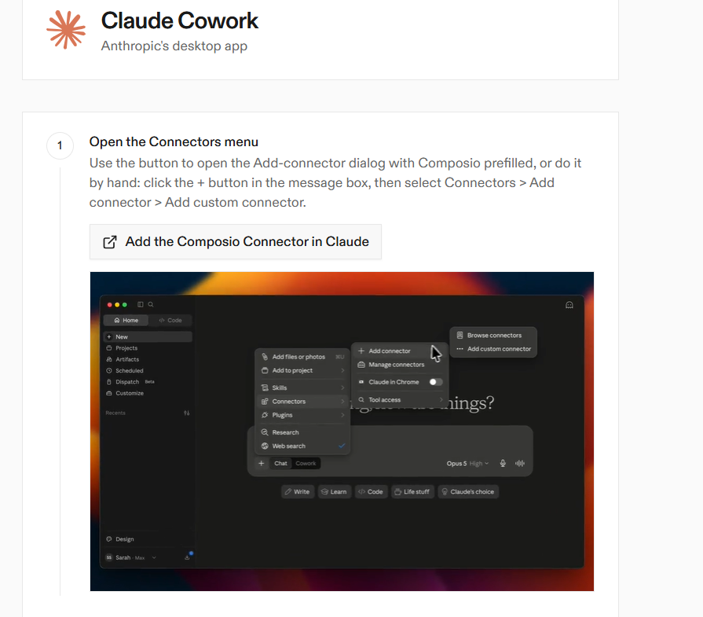

# Chief of Staff System — Finance-First Starter

A user-owned, model-agnostic Chief of Staff workspace that begins with something concrete: understanding expenses and building a useful budget from screenshots, receipts, and statements.

The intended experience is:

```text
Download ZIP → upload one folder → convert one workbook → paste one folder link → onboarding starts
```

No personal case study or private user data is included in this repository. Every example and template is generic and publication-safe.

## Download the ready-to-use starter

**[Download COS Finance-First Starter ZIP](dist/COS_Finance_First_Starter.zip?raw=1)**

The ZIP already contains:

- A styled finance-first workbook
- The complete agent instructions
- The one prompt the user sends
- Expense screenshot and document inboxes
- Evidence and report folders
- Optional profile fields
- An advanced Google Apps Script fallback

## Five-step setup

### 1. Download and extract

Download the starter ZIP above and extract it. You will get one folder named:

```text
COS_Finance_First_Starter
```

### 2. Upload one folder

Upload the entire extracted folder to a private Google Drive folder. Keep access set to **Restricted**. Do not make it public.

### 3. Create the native Google Sheet

A native Google Sheet cannot exist inside a downloadable ZIP, so one conversion is required:

1. Inside Google Drive, open `COS_DATABASE_TEMPLATE.xlsx` with Google Sheets.
2. Choose **File → Save as Google Sheets**.
3. Name the new native Sheet `COS_DATABASE`.
4. Keep it in the uploaded starter folder.

The original `.xlsx` remains a clean template. The new native Sheet becomes the operational source of truth.

### 4. Copy the folder link into the supplied prompt

1. Open `01_COPY_THIS_PROMPT.txt`.
2. Copy the private Google Drive folder link.
3. Replace `[PASTE GOOGLE DRIVE FOLDER LINK HERE]` in the prompt.
4. Send the complete prompt to the AI agent.

That is the only prompt the user needs to prepare.

### 5. Let the system test itself

Before asking personal questions, the agent must:

1. Find and read `00_START_HERE.md`.
2. Find the native `COS_DATABASE` Sheet.
3. Read `System Check`.
4. Write a harmless test value.
5. Read the value back.
6. Add an `Agent Log` entry.
7. Read the log entry back.

If the connector is read-only, the agent must explain the exact limitation and stop. **A prompt cannot grant write access that the active connector or AI plan does not provide.**

Use an agent environment with read/write access to the private Google Drive folder and Google Sheet for full automation. With a read-only connector, the system can still analyse and propose rows, but it cannot honestly maintain the database itself.

## What happens during onboarding

The first mission is finance, not biography.

The agent begins with one useful open question:

> Describe your financial situation in plain English. Include your income and expenses, their amounts, and the dates you receive or pay them. Mention whether each item repeats. You can provide screenshots or statements afterward if you want.

For example:

> I earn 3,500 EUR every month and get paid on the 1st. I pay 600 EUR rent on the 5th of every month.

The agent extracts currency, dates, recurrence, income, and expenses from the answer and updates the Google Sheet. It does **not** ask the user to choose a reporting period before any data exists. Follow-up questions are reserved for material gaps that prevent a correct record.

The user's name and other identity details are optional.

Screenshots, receipts, exports, or statements are optional supporting evidence and can be added afterward in:

```text
Inbox/Expenses-and-Receipts
```

It writes and verifies `Income`, `Expenses`, and `Recurring Costs` records from the plain-English description. If evidence is later provided, it extracts visible information, detects duplicates, links the source, and updates confidence. It never guesses a missing amount, date, merchant, source, or currency.

The first report covers:

- Total recorded income
- Total recorded expenses
- Expected net cash flow
- Spending by category
- Recurring costs and possible subscriptions
- Fixed versus variable spending
- Missing or ambiguous information
- A proposed budget
- The most useful evidence to provide next

## Default agent authority

The default role is **Workspace Operator**.

Inside the configured COS folder, the agent may autonomously:

- Read and organize files
- Create and update Sheet records
- Process financial screenshots and documents
- Create and update Income records
- Create provisional Expenses
- Maintain Budget and Recurring Cost records
- Create reports and internal Actions
- Correct verified internal errors
- Log and verify material writes

It does not need approval for every routine internal update.

The agent must ask before:

- Spending or transferring money
- Sending external communications
- Publishing information
- Signing or accepting terms
- Changing sharing permissions
- Deleting original evidence or records
- Acting outside the configured COS folder

The advanced numeric permission levels still exist, but beginners do not need to configure them.

## Starter folder structure

```text
COS_Finance_First_Starter/
├── 00_START_HERE.md
├── 01_COPY_THIS_PROMPT.txt
├── COS_DATABASE_TEMPLATE.xlsx
├── Inbox/
│   ├── Expenses-and-Receipts/
│   └── Other-Documents/
├── Evidence/
├── Reports/
└── System/
    ├── AGENT_RULES.md
    ├── FINANCE_WORKFLOW.md
    ├── DATA_DICTIONARY.md
    ├── OPTIONAL_PROFILE.md
    └── Advanced/
        └── OPTIONAL_Code.gs
```

## Database tabs

### Finance-first

- `System Check`
- `Income`
- `Expenses`
- `Budget`
- `Recurring Costs`

### Broader Chief of Staff system

- `Inbox`
- `Projects`
- `Actions`
- `Commitments`
- `Decisions`
- `Contacts`
- `Reviews`
- `Agent Log`

The Google Sheet stores structured operational state. Google Drive stores screenshots, documents, and evidence. Reports are derived views, not another database.

## Supported agent environments

The bootstrap folder is model-agnostic. It can be used with Hermes, ChatGPT Projects, Claude Projects, Gemini, or another agent environment **when that environment can access the folder and perform the required Sheet operations**.

Platform-specific advanced setup remains available:

- [Hermes profile](adapters/hermes/README.md)
- [ChatGPT Project](adapters/chatgpt/README.md)
- [Claude Project](adapters/claude/README.md)
- [Agent profiles and projects](docs/profiles.md)

### Optional tested free-tier workaround: Claude + Composio

This is **not the default agent or the main setup path**. It is included because, during project testing, Claude connected through Composio was the only free-tier workaround verified for the required Google Drive and Google Sheets operations. Native connectors and plan capabilities change, so always rely on the System Check write-and-read-back test rather than the connector label alone.

To reproduce that optional setup:

1. Sign in to [Claude](https://claude.ai/) in your browser first.
2. Open [Composio](https://composio.dev/), choose **Claude**, then choose **Install for Claude & Cowork**.
3. Click **Add the Composio Connector in Claude**. Because you are already signed in, Claude should open the connector flow with Composio prefilled.
4. Select **Next** or **Continue** through the connection screens until Claude confirms that the connector is connected.
5. In Composio, authorize Google Drive and Google Sheets with only the access this private COS folder requires.
6. Return to Claude, send the supplied bootstrap prompt, and require the System Check write-and-read-back test. Do not continue if either Sheet write cannot be verified.



> This optional workaround avoids relying on a read-only native connector. It does not make paid Claude features free, and availability may change. Never place Google credentials, connector tokens, or private links in this repository.

## Optional dashboard

After the core system works, an optional dashboard can display Today, Approvals, Projects, Risks, Decisions, Reviews, and Agent Activity.

See [GPT Sites dashboard concept](docs/dashboard-gpt-sites.md). The dashboard is a replaceable view and never a second source of truth.

## Privacy boundary

Treat every tracked repository file as public, even while development occurs privately.

Never commit:

- Completed user profiles
- Real expense records or screenshots
- Private Google links
- Email addresses or account identifiers
- API keys, tokens, cookies, or credentials
- Financial balances, health information, or identity documents
- Raw private conversations

See [Privacy and public-repository rules](docs/privacy.md) and [Security policy](SECURITY.md).

## Build the starter package

For contributors:

```bash
python -m pip install -r requirements-dev.txt
python scripts/build_starter_kit.py
```

This regenerates:

- `starter-kit/COS_DATABASE_TEMPLATE.xlsx`
- `starter-kit/System/Advanced/OPTIONAL_Code.gs`
- `dist/COS_Finance_First_Starter.zip`

## Validate the repository

```bash
python scripts/validate.py
python -m unittest discover -s tests -v
```

Validation checks the public template, schemas, workbook, distributable ZIP, links, private-resource patterns, and common secret formats.

## Architecture

The beginner experience is intentionally small, while the internal architecture remains portable:

```text
Experience       One folder link and one bootstrap prompt
Agent            Hermes | ChatGPT | Claude | Gemini | other
Kernel           Finance-first workflow | authority | reliability
User-owned data  Google Sheets | Google Drive | Markdown
```

More detail: [Architecture](docs/architecture.md).

## License

[MIT](LICENSE)
